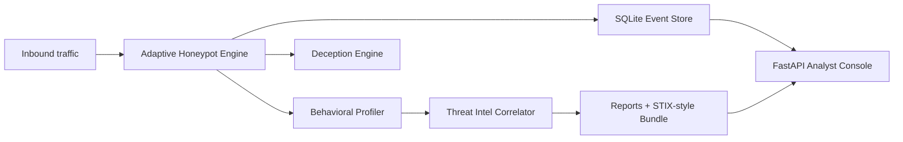

# SentinelMesh

SentinelMesh is a defensive deception platform built to look, feel, and deploy like a serious cybersecurity product. It launches decoy services, captures hostile behavior, scores attacker intent, correlates optional threat intelligence, and surfaces the operation through an analyst-focused dashboard.

## What It Does

- Runs deceptive HTTP, FTP, SMTP, and SSH-style services
- Captures commands, payloads, source IPs, and session metadata
- Builds attacker profiles with risk scoring and threat IDs
- Generates JSON and PDF intelligence reports
- Exposes a polished FastAPI dashboard with deployment posture, risk composition, and live telemetry
- Ships with Windows scripts, Docker support, health checks, demo tooling, and test coverage

## Architecture



## Project Layout

```text
project-root/
|-- .env.example
|-- Dockerfile
|-- README.md
|-- deploy/
|   |-- docker-compose.yml
|   |-- iptables_rules.sh
|   |-- sentinelmesh.service
|   `-- setup.sh
|-- docs/
|   |-- API_KEYS_AND_DEMO.md
|   `-- WINDOWS_DEPLOYMENT.md
|-- scripts/
|   |-- demo_local.py
|   |-- run_demo.ps1
|   |-- setup_windows.cmd
|   `-- start_windows.ps1
|-- sentinelmesh/
|   |-- config.py
|   |-- dashboard.py
|   |-- honeypot_engine.py
|   |-- main.py
|   |-- storage.py
|   `-- templates/index.html
`-- tests/
```

## Quick Start On Windows

From `cmd.exe`:

```bat
python -m venv .venv
call .venv\Scripts\activate.bat
python -m pip install --upgrade pip
python -m pip install -e .[dev,intel,analytics,ssh]
copy .env.example .env
python -m sentinelmesh doctor
python -m sentinelmesh train --dataset sample_sequences.json
python -m sentinelmesh serve
```

Then open:

```text
http://127.0.0.1:8000
```

If you want a one-command Windows setup:

```bat
scripts\setup_windows.cmd
```

## Real-World Posture

SentinelMesh is a deception/honeypot surface, not a safe production service. Before you
put it on anything reachable:

- Run it in an isolated VM, container, or cloud sandbox.
- Keep the analyst console on `127.0.0.1` unless you add authentication and access control
  in front of it.
- Use non-privileged ports so the process can run as an unprivileged user.
- Set `SENTINELMESH_TELEMETRY_TOKEN` unless you are using lab/demo mode.
- Treat captured credentials as hostile telemetry, not as secrets to replay.
- Rotate SSH host keys and review reports regularly with `python -m sentinelmesh doctor`.

For a controlled smoke test on localhost, you can still feed it benign traffic with:

```bat
call .venv\Scripts\activate.bat
python .\scripts\demo_local.py
```

That script only targets localhost and is intended for setup validation, not for live
engagement traffic.

## Dashboard And Health Endpoints

- `GET /` renders the analyst console
- `GET /api/overview` returns dashboard data as JSON
- `GET /healthz` returns liveness information
- `GET /readyz` returns readiness and deployment warnings

## Docker Deployment

```powershell
Copy-Item .env.example .env
docker compose -f .\deploy\docker-compose.yml up --build -d
```

The Docker deployment now forces the dashboard to bind on `0.0.0.0` inside the container so the published port is actually reachable from the host.

Stop it with:

```powershell
docker compose -f .\deploy\docker-compose.yml down
```

## Deployment Notes

- Keep the dashboard private unless you add authentication in front of it.
- Run the deception services in an isolated VM, lab host, or cloud sandbox.
- Use non-privileged decoy ports so the process can run as an unprivileged user.
- Use `python -m sentinelmesh doctor` before exposing the stack.
- Add CTI API keys in `.env` if you want external enrichment.
- In non-lab environments the console now requires `SENTINELMESH_TELEMETRY_TOKEN` by default.
- Disable shell prediction hints (`SENTINELMESH_SHELL_LEAK_PREDICTIONS=0`) unless you want
  the decoy to advertise its next-move guesses.

## Documents

- [Windows deployment guide](docs/WINDOWS_DEPLOYMENT.md)
- [API keys and demo guide](docs/API_KEYS_AND_DEMO.md)
- [Security policy](SECURITY.md)
- [Contribution guide](CONTRIBUTING.md)
